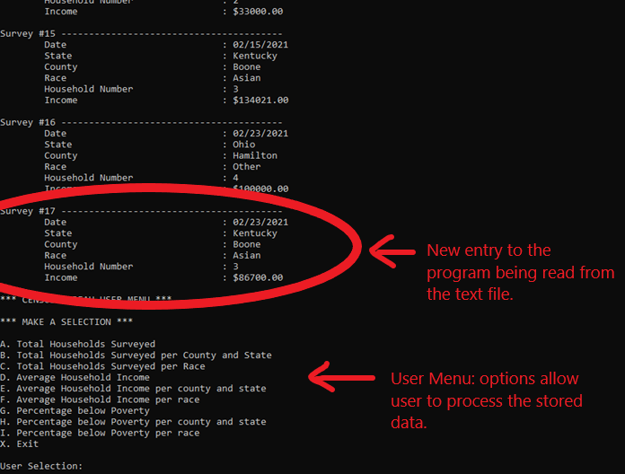

# Census Bureau Survey  
[Live Video Demo](https://www.youtube.com/embed/rx9dU2HvyU0)

---

## Description
This application is designed to collect data for a census bureau survey,  
for the areas of Southern Ohio and Northern Kentucky.  

It is written in ‘C’ programming language and is a console application  
that was created in Visual Studio Enterprise 2019.      
 

## How To Use the Application

It is a two-part project:  
1. Write_File.c will write/append the data collected from the user to a text file.  

    The data being collected is:  
    * Date of survey
    * State
    * County
    * Race of head of household
    * Number of household occupants 
    * Yearly income for household     
 
   

__Data Input in Console:__  
  

 
 

__Data Appended to Text File:__  

 

2. Read_File.c will read the text file, store the data into a structure array and format it neatly.  
The array will then be processed in one of ten ways, depending on the user’s choice.  

    The user’s options include:  
    * Total Households Surveyed 
    * Total Households Surveyed per County and State 
    * Total Households Surveyed per Race    
    * Average Household Income 
    * Average Household Income per County and State 
    * Average Household Income per race
    * Percentage below Poverty 
    * Percentage below Poverty per County and State 
    * Percentage below Poverty per Race
    * Exit  
 
 

__Data Output in Console:__    

 

## Live Video Demo  
Click [here](https://www.youtube.com/embed/rx9dU2HvyU0) for a live demonstration of  the program.  

 

## Conclusion  
This application was created as a final project for my C Programming course in college.  
Some of the code in Read_File.c uses self-written functions, instead of using built-in functions  
provided by some of the C libraries. We were not permitted to use the built-in functions most of  
the course, so I decided to include some of my "basic training" in the code.  
I hope you got a chance to check out the live video demonstration in the links provided.  
All the source code for the project is included in this repository.  
Thank you for your time!
